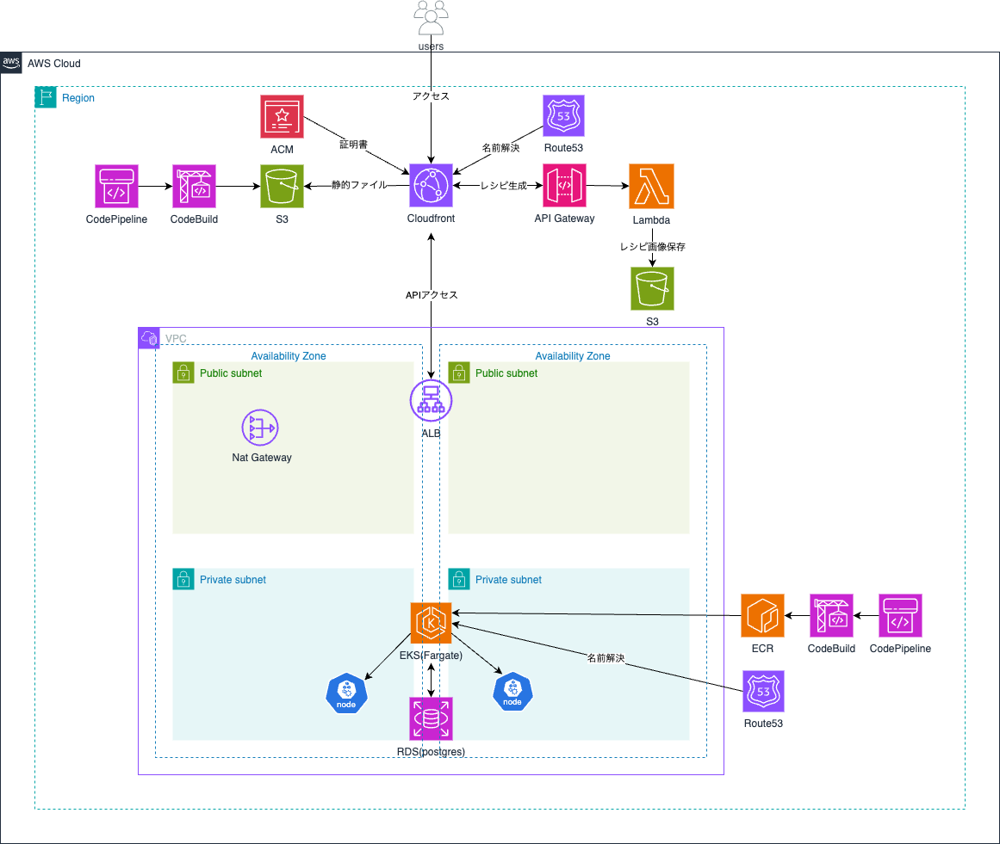

# サービス名：みんなの食卓

## アプリケーションの概要

調理時間、コンセプト、食材を入力することで好みに合わせた料理レシピを生成するアプリです。  
ログインすることで、生成したレシピをお気に入りレシピとして保存可能になります。

## このアプリケーションを作ろうと思ったきっかけ

自炊する中で余った食材を腐らせてしまうことが多かったので、  
余った食材を使ったレシピを気軽に生成することができれば食品ロスに繋がると考え制作しました。

## インフラ構成図

## 使用技術

| カテゴリ        | 技術名                                  |
|----------------|----------------------------------------|
| バックエンド     | Go(Echo, GORM)           　            |
| フロントエンド   | React(Vite), TypeScript, TailwindCSS   |
| データベース     | PostgreSQL                             |
| インフラ        | AWS, Terraform                         |
| CI/CD         | CodePipeline, CodeBuild, GitHub Actions |
| テスト         | testing, Vitest, Testing Library        |
